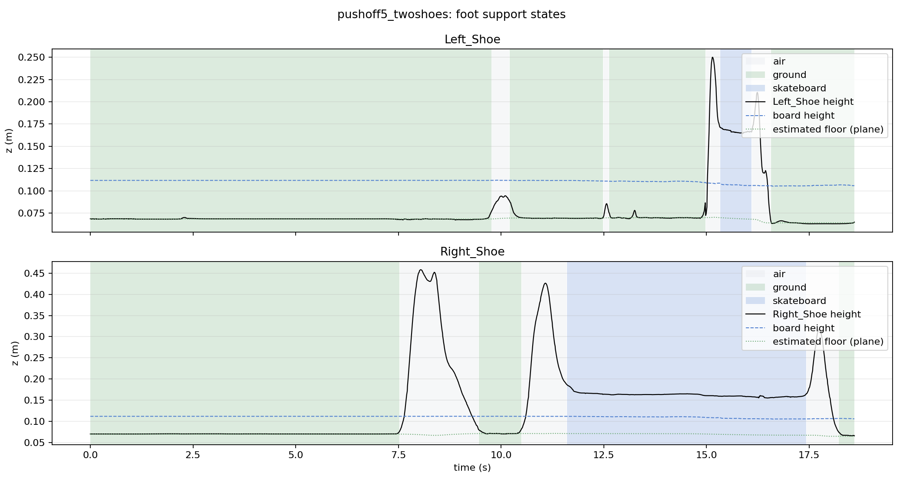

# contact-detection

NumPy-first utilities for detecting quiet intervals and likely support contacts
from mocap-style motion time series.

Contact is not detected from raw height alone. The library first detects
quiet/stable candidate intervals, infers a support surface, computes clearance
and slip relative to that support, then fuses those features into contact
scores.

## Installation

```bash
python -m pip install -e ".[dev]"
```

## Quick Start

Scalar quiet detection:

```python
from contact_detection import QuietDetectionConfig, QuietSignalType, detect_quiet_intervals

config = QuietDetectionConfig(signal_type=QuietSignalType.POSITION_COMPONENT)
result = detect_quiet_intervals(t, z, config=config)

print(result.intervals)
print(result.mask)
```

3D contact detection:

```python
from contact_detection import ContactDetectionConfig, detect_contact_intervals

result = detect_contact_intervals(t, points, config=ContactDetectionConfig())

print(result.intervals)
print(result.scores)
print(result.features["point_scores"])
```

Custom support surface:

```python
from contact_detection import PlaneSupportModel, SupportDetectionConfig, detect_contact_intervals

surface = PlaneSupportModel.fit(candidate_points, SupportDetectionConfig(model_type="plane"))
result = detect_contact_intervals(t, points, supports=surface)
```

Foot support state plot for unified NPZ files:

```bash
python main.py --config configs/config.yaml
```



`main.py` scans for `*/unified.npz` files containing `t`,
`vicon__body_names`, and `vicon__body_pos`, then writes
`outputs/<trial>_foot_support_states.png` with per-foot `air`, `ground`, and
`skateboard` annotations. The YAML config controls input/output paths, body
names, floor fitting, and contact thresholds.

Command-line arguments can still override the YAML temporarily:

```bash
python main.py --config configs/config.yaml data --output outputs_plane --floor-model plane
```

## YAML Configs and Data

The default runtime config is `configs/config.yaml`. It controls:

- input/output paths
- tracked foot and board body names
- floor model selection (`height` or `plane`)
- ground and skateboard contact thresholds
- temporal cleanup windows

Trial recordings are intentionally not versioned. Put local `unified.npz` files
under `data/<trial>/unified.npz`; generated diagnostic plots are written to
`outputs/` by default. Both directories are ignored by git.

## Public API

```python
from contact_detection import (
    ContactDetectionConfig,
    QuietDetectionConfig,
    QuietSignalType,
    VectorQuietMode,
    detect_contact_intervals,
    detect_quiet_intervals,
)
```

## Support Models

- `PlaneSupportModel`: RANSAC plane fit with SVD refinement.
- `HeightmapSupportModel`: sparse cell heightmap fallback for non-coplanar supports.
- `LocalPercentileHeightmap`: local-neighborhood lower-envelope support estimate.
- `fit_best_support_surface`: plane-first auto selection with heightmap fallback.

Heightmaps are intentionally not the first default. Sparse candidate points can
overfit terrain, so `model_type="auto"` tries a plane first and falls back only
when residuals fail the configured coplanarity threshold.

## Failure Modes

- No true support/contact samples in the data.
- Too few quiet support candidates.
- Quiet hovering above a support surface.
- Contacts on moving objects. `moving_support_mode` is reserved for future work
  and currently raises `NotImplementedError`.
- Highly deformable surfaces.
- Marker or rigid-body origins that shift relative to the physical contact patch.
- Severe occlusion/dropout.
- Heightmap extrapolation outside observed support regions.

## Verification

```bash
python -m unittest discover -s tests -v
ruff check .
```
