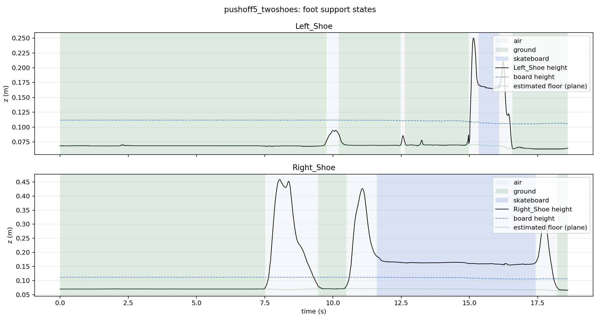

# contact-detection

NumPy-first utilities for detecting quiet intervals and likely support contacts
from mocap-style motion time series.

Contact is not detected from raw height alone. The library first detects
quiet/stable candidate intervals, infers a support surface, computes clearance
and slip relative to that support, then fuses those features into contact
scores.

## Installation

```bash
python -m pip install -e ".[dev]"
```

## Quick Start

Scalar quiet detection:

```python
from contact_detection import QuietDetectionConfig, QuietSignalType, detect_quiet_intervals

config = QuietDetectionConfig(signal_type=QuietSignalType.POSITION_COMPONENT)
result = detect_quiet_intervals(t, z, config=config)

print(result.intervals)
print(result.mask)
```

3D contact detection:

```python
from contact_detection import ContactDetectionConfig, detect_contact_intervals

result = detect_contact_intervals(t, points, config=ContactDetectionConfig())

print(result.intervals)
print(result.scores)
print(result.features["point_scores"])
```

Custom support surface:

```python
from contact_detection import PlaneSupportModel, SupportDetectionConfig, detect_contact_intervals

surface = PlaneSupportModel.fit(candidate_points, SupportDetectionConfig(model_type="plane"))
result = detect_contact_intervals(t, points, supports=surface)
```

Foot support state plot for unified NPZ files:

```bash
python main.py --config configs/config.yaml
```



`main.py` scans for `*/synced.npz` files containing `t`,
`vicon__body_names`, and `vicon__body_pos`, then writes
`outputs/<trial>_foot_support_states.png` with per-foot `air`, `ground`, and
`skateboard` annotations. The YAML config controls input/output paths, body
names, floor fitting, and contact thresholds.

Command-line arguments can still override the YAML temporarily:

```bash
python main.py --config configs/config.yaml data --output outputs_plane --floor-model plane
```

## YAML Configs and Data

The default runtime config is `configs/config.yaml`. It controls:

- input/output paths
- tracked foot and board body names
- floor model selection (`height` or `plane`)
- ground and skateboard contact thresholds
- temporal cleanup windows

Trial recordings are intentionally not versioned. Put local `synced.npz` files
under `data/<trial>/synced.npz`; generated diagnostic plots are written to
`outputs/` by default. Both directories are ignored by git.

## Public API

```python
from contact_detection import (
    ContactDetectionConfig,
    QuietDetectionConfig,
    QuietSignalType,
    VectorQuietMode,
    detect_contact_intervals,
    detect_quiet_intervals,
)
```

## Contact surface geometry

A contact surface is defined by a rigid transform **`T_body_contact`** from the
body root frame to a contact frame whose **+Z axis is the outward normal** (away
from the partner surface), plus an optional tangent-plane region.

```python
from scipy.spatial.transform import Rotation

from contact_detection import (
    BodyFrameTranslation,
    PatchCalibration,
    RigidBodyContactModel,
    RigidTransform,
)

shoe = RigidBodyContactModel(
    body_name="Left_Shoe",
    patch_calibrations={
        "sole": PatchCalibration(
            marker_translations={
                "heel": BodyFrameTranslation(vector_body=(0.0, 0.0, -0.025)),
                "toe": BodyFrameTranslation(vector_body=(0.0, 0.0, -0.015)),
            }
        )
    },
)
compiled = shoe.compile(
    marker_positions_world={"heel": heel_world, "toe": toe_world},
    body_translation=body_origin,
    body_rotation=Rotation.from_quat(body_quat_xyzw),
)
sole = compiled.patch("sole")
view = sole.view(RigidTransform(translation=body_origin, rotation=Rotation.from_quat(body_quat_xyzw)))
```

For foot-support plane floors, pass `contact_models=(shoe, ...)` with
`floor_fit_marker_pos` and per-body quaternions. The plane is fit from sole-surface samples on
**ground-contact** frames (seeded provisionally, then refined); clearance and plots use the compiled
sole contact origin (`sole_height` / `floor_height_at_sole` features).

For contact-interval detection, pass the same contact models on
`SupportDetectionConfig` together with per-body quaternions when offsets are
body-local:

```python
from contact_detection import ContactDetectionConfig, SupportDetectionConfig, detect_contact_intervals

result = detect_contact_intervals(
    t,
    marker_pos,
    config=ContactDetectionConfig(
        support_config=SupportDetectionConfig(
            marker_names=("heel", "toe"),
            contact_models=(shoe,),
            body_rotations={"Left_Shoe": body_quat_xyzw},
        )
    ),
)
```

`estimate_contact_offset` is separate: it infers a per-marker clearance bias from
quiet samples at runtime rather than from catalog geometry.

## Support Models

- `PlaneSupportModel`: RANSAC plane fit with SVD refinement.
- `HeightmapSupportModel`: sparse cell heightmap fallback for non-coplanar supports.
- `LocalPercentileHeightmap`: local-neighborhood lower-envelope support estimate.
- `fit_best_support_surface`: plane-first auto selection with heightmap fallback.

Heightmaps are intentionally not the first default. Sparse candidate points can
overfit terrain, so `model_type="auto"` tries a plane first and falls back only
when residuals fail the configured coplanarity threshold.

## Failure Modes

- No true support/contact samples in the data.
- Too few quiet support candidates.
- Quiet hovering above a support surface.
- Contacts on moving objects. `moving_support_mode` is reserved for future work
  and currently raises `NotImplementedError`.
- Highly deformable surfaces.
- Marker or rigid-body origins that shift relative to the physical contact patch.
- Severe occlusion/dropout.
- Heightmap extrapolation outside observed support regions.

## Verification

```bash
python -m unittest discover -s tests -v
ruff check .
```
